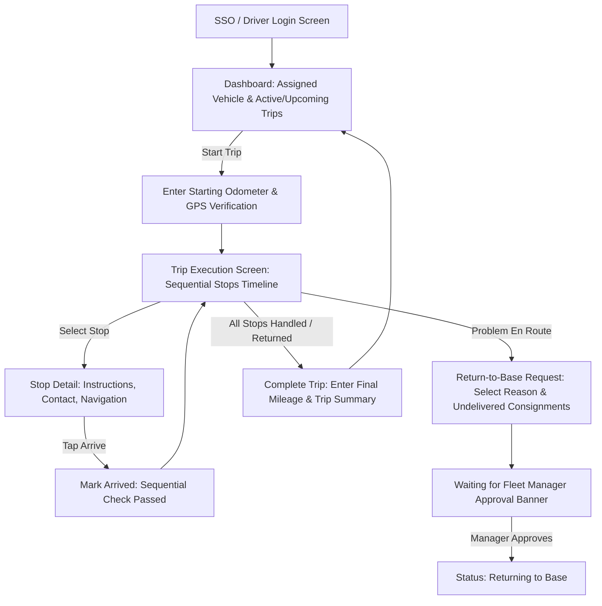

# KPFC Fleet Management — Driver Mobile Application & Operations Specification

> **Document Status:** Planning & Architecture Baseline  
> **Target Platform:** Android (Native Kotlin / Jetpack Compose)  
> **Backend System:** KPFC Fleet Management & Telematics API (Laravel 12 / PHP 8.5)  
> **Reference Documents:** [FLEETDOC.MD](FLEETDOC.MD) & [TODO.MD](TODO.MD) (Phase 6)

---

## 1. Overview & Operational Scope

The KPFC Driver Mobile Application is the frontline operational client for commercial transport execution across the KPFC branch network. Drivers use this native Android application to receive assigned trips, navigate sequential delivery stops, record stop arrival and completion, request return-to-base authorizations when unforeseen obstacles occur, and record accurate trip mileage.

### Core Principles
1. **Sequential Stop Integrity:** Drivers must execute stops in planned sequence unless explicitly overridden or authorized to return to base.
2. **Offline-Resilient Operation:** Drivers may enter basements, remote depots, or dead zones with degraded cellular connectivity. All trip details must be cached locally, and actions must queue for synchronization.
3. **Immutability of Business Requirements:** Drivers cannot arbitrarily alter or drop stops from a transport request; alterations require formal Return-to-Base requests approved by a Fleet Manager.
4. **Mileage & Telematics Auditability:** Starting and ending mileages recorded by the driver are audited against the onboard Protrack365 GPS telemetry.

---

## 2. Backend Phase 6 Implementation Plan (Fleet API)

The backend provides the operational schema, business rules, and RESTful API endpoints consumed by the Android app and Fleet Managers.

### 2.1 Database Schema & Migrations

#### `trips` Table
| Column | Type | Attributes / Purpose |
|---|---|---|
| `id` | unsigned big integer | Primary Key |
| `trip_number` | string(64) | Unique human-readable code (e.g., `TRP-2026-00001`) |
| `transport_request_id` | unsigned big integer | Nullable, links to commercial transport request |
| `vehicle_id` | unsigned big integer | Foreign Key to `vehicles(id)` |
| `driver_external_user_id` | string(100) | Indexed, external user identity from KPFC SSO |
| `status` | string(32) | `planned`, `in_progress`, `returning_to_base`, `completed`, `cancelled` |
| `planned_start` | timestamp | Nullable scheduled start |
| `actual_start` | timestamp | Nullable timestamp when driver starts trip |
| `planned_end` | timestamp | Nullable scheduled completion |
| `actual_end` | timestamp | Nullable actual completion timestamp |
| `start_latitude` | decimal(10, 7) | Nullable GPS coordinate at start |
| `start_longitude` | decimal(10, 7) | Nullable GPS coordinate at start |
| `start_location_name` | string | Nullable location name / address at start |
| `starting_mileage` | unsigned integer | Nullable odometer reading at start (km) |
| `ending_mileage` | unsigned integer | Nullable odometer reading at end (km) |
| `trip_mileage` | unsigned integer | Computed: `ending_mileage - starting_mileage` |
| `planned_route` | json | Nullable planned OSRM geo-route |
| `actual_route` | json | Nullable breadcrumb history |
| `timestamps` | timestamps | `created_at`, `updated_at` |

#### `trip_stops` Table
| Column | Type | Attributes / Purpose |
|---|---|---|
| `id` | unsigned big integer | Primary Key |
| `trip_id` | unsigned big integer | Foreign Key to `trips(id)` (cascade delete) |
| `sequence` | unsigned small integer | Stop sequence index (1, 2, 3...) |
| `stop_type` | string(32) | `pickup`, `delivery`, `return`, `waypoint` |
| `shop_id` | unsigned big integer | Nullable Foreign Key to `shops(id)` |
| `external_shop_id` | string(100) | Nullable reference to Business/Finance shop ID |
| `location_name` | string | Branch name or client destination |
| `address` | string | Nullable physical address |
| `latitude` | decimal(10, 7) | Destination GPS latitude |
| `longitude` | decimal(10, 7) | Destination GPS longitude |
| `contact_phone` | string | Nullable receiver phone number |
| `delivery_instructions` | text | Nullable notes / gate codes / dispatch notes |
| `status` | string(32) | `pending`, `arrived`, `completed`, `failed`, `cancelled` |
| `arrived_at` | timestamp | Nullable arrival confirmation timestamp |
| `departed_at` | timestamp | Nullable departure timestamp |
| `timestamps` | timestamps | `created_at`, `updated_at` |

*Constraint:* Unique composite index on `['trip_id', 'sequence']`.

#### `return_to_base_requests` Table
| Column | Type | Attributes / Purpose |
|---|---|---|
| `id` | unsigned big integer | Primary Key |
| `trip_id` | unsigned big integer | Foreign Key to `trips(id)` |
| `driver_external_user_id` | string(100) | Driver submitting the request |
| `reason` | text | Explanation (e.g. breakdown, road blocked, shop closed) |
| `latitude` | decimal(10, 7) | Driver's location when requesting |
| `longitude` | decimal(10, 7) | Driver's location when requesting |
| `current_location_name` | string | Nullable address/geocoded landmark |
| `undelivered_stops` | json | Snapshot of remaining stop IDs and descriptions |
| `status` | string(32) | `pending`, `approved`, `denied` |
| `requested_at` | timestamp | Submission time |
| `decision` | string(32) | Nullable: `approved` or `denied` |
| `decision_maker_external_user_id` | string(100) | Nullable: Fleet Manager who decided |
| `decided_at` | timestamp | Nullable: Decision timestamp |
| `manager_comments` | text | Nullable: Fleet Manager remarks |
| `timestamps` | timestamps | `created_at`, `updated_at` |

---

### 2.2 API Endpoints

#### Driver Endpoints (`/api/driver/*`)
*Protected by: `['web', 'auth', 'fleet.access']` with driver scope validation*

1. **`GET /api/driver/trips/active`**
   - Returns current trip with status `in_progress` or `returning_to_base` assigned to the authenticated driver.
   - Includes vehicle details, live GPS status, ordered stops, and active return request status.
2. **`GET /api/driver/trips/upcoming`**
   - Returns list of trips with status `planned` assigned to driver, sorted by `planned_start ASC`.
3. **`GET /api/driver/assigned-vehicle`**
   - Returns vehicle details for the active trip (or next scheduled trip).
4. **`POST /api/driver/trips/{trip}/start`**
   - Manually starts a planned trip.
   - Payload: `{ starting_mileage?: int, start_latitude?: float, start_longitude?: float, start_location_name?: string }`
   - Transitions `trip.status = 'in_progress'`, sets `actual_start = now()`.
5. **`GET /api/driver/trips/{trip}/stops`**
   - Returns ordered list of stops for the specified trip.
6. **`POST /api/driver/stops/{stop}/arrive`**
   - Marks a stop as `arrived`.
   - **Enforces sequential logic:** returns HTTP 422 if preceding stops (`sequence < current`) are still `pending`.
   - Sets `status = 'arrived'` and `arrived_at = now()`.
7. **`POST /api/driver/trips/{trip}/return-to-base`**
   - Driver requests early return to base with undelivered consignments.
   - Payload: `{ reason: string, latitude?: float, longitude?: float, current_location_name?: string }`
   - Automatically snapshots pending stops and creates a pending `ReturnToBaseRequest`.
8. **`POST /api/driver/trips/{trip}/complete`**
   - Completes the trip upon arrival at the home terminal.
   - Payload: `{ ending_mileage: int }`
   - Validates `ending_mileage >= starting_mileage`.
   - Computes `trip_mileage = ending_mileage - starting_mileage`, updates vehicle odometer, transitions `trip.status = 'completed'`.

#### Fleet Manager Review Endpoints (`/api/fleet/return-requests/*`)
*Protected by: `['web', 'auth', 'fleet.access', 'fleet.write']`*

1. **`GET /api/fleet/return-requests`**
   - Lists return requests with filters (`status=pending`, `trip_id`, etc.).
2. **`POST /api/fleet/return-requests/{returnRequest}/decision`**
   - Payload: `{ decision: "approved" | "denied", manager_comments?: string }`
   - Records manager ID, decision time, and comments.
   - If approved, transitions `trip.status = 'returning_to_base'`.

---

## 3. Android Application Architecture & Plan

### 3.1 Technology Stack

| Component | Choice | Rationale |
|---|---|---|
| **Language** | Kotlin 2.x | Standard modern Android language, full coroutines & Flow support |
| **UI Framework** | Jetpack Compose + Material 3 | Declarative UI, reactive state handling, faster UI iteration |
| **Architecture** | MVVM / MVI + Clean Architecture | Clear separation of UI, Domain use cases, and Data repositories |
| **Local Storage** | Room DB + DataStore | Offline caching of active trip, stops, and offline action queue |
| **Networking** | Retrofit 2 + OkHttp 3 + Kotlin Serialization | REST API integration with token authenticator and retry policies |
| **Dependency Injection** | Hilt | Android-standard dependency injection |
| **Background Sync** | WorkManager | Guaranteed execution of queued offline mutations (stop arrival, completion) |
| **Location & Maps** | Google Play Services Location (FusedLocationProvider) + MapLibre / Google Maps SDK | High-accuracy GPS capture and turn-by-turn navigation intent dispatch |
| **Min SDK / Target SDK** | Min SDK 26 (Android 8.0) / Target SDK 35 (Android 15) | Covers 95%+ of active enterprise Android devices |

---

### 3.2 Android App Module Structure

```text
app/
├── data/
│   ├── api/                     # Retrofit interfaces, DTOs, interceptors
│   │   ├── DriverApiService.kt
│   │   ├── AuthInterceptor.kt
│   │   └── dto/
│   ├── db/                      # Room database, DAOs, entities
│   │   ├── FleetDatabase.kt
│   │   ├── dao/TripDao.kt
│   │   ├── dao/TripStopDao.kt
│   │   ├── dao/OfflineActionDao.kt
│   │   └── entity/
│   ├── repository/              # Repository implementations
│   │   ├── TripRepositoryImpl.kt
│   │   └── OfflineSyncRepositoryImpl.kt
│   └── worker/                  # WorkManager background workers
│       └── SyncOfflineActionsWorker.kt
├── domain/
│   ├── model/                   # Clean domain models (Trip, TripStop, Vehicle)
│   ├── repository/              # Repository interfaces
│   └── usecase/
│       ├── GetActiveTripUseCase.kt
│       ├── StartTripUseCase.kt
│       ├── ConfirmStopArrivalUseCase.kt
│       ├── RequestReturnToBaseUseCase.kt
│       └── CompleteTripUseCase.kt
├── ui/
│   ├── auth/                    # Login & SSO screen
│   ├── dashboard/               # Active trip card, assigned vehicle, upcoming trips
│   ├── trip/                    # Active trip execution, ordered stops list
│   ├── stop/                    # Stop details, contact, navigation, arrive action
│   ├── return/                  # Return-to-base request dialog and status tracker
│   ├── completion/              # Trip completion & odometer entry dialog
│   ├── theme/                   # KPFC Material 3 color palettes and typography
│   └── navigation/              # Compose Navigation Destinations
└── di/                          # Hilt dependency injection modules
```

---

### 3.3 Core Android Screens & User Flows



#### Screen 1: Dashboard (`ui/dashboard`)
- **Header:** Driver Name, online/offline sync status badge.
- **Active Trip Hero Card:** If trip is `in_progress`, highlights current destination stop, estimated distance, progress bar (e.g., "Stop 2 of 5").
- **Assigned Vehicle Badge:** Plate number, model, assigned home branch.
- **Upcoming Trips Carousel:** Cards displaying upcoming planned trips with date, stop count, and destination branch.

#### Screen 2: Trip Execution Screen (`ui/trip`)
- **Top Bar:** Trip number (`TRP-2026-00001`), vehicle plate, quick Return-to-Base action button.
- **Interactive Map / Overview:** Shows current vehicle location and stop route markers.
- **Ordered Stops Timeline (Vertical Stepper):**
  - **Completed Stops:** Green checkmark, arrival timestamp.
  - **Current Active Stop:** Blue highlight, "Navigate" button (opens Google Maps / Waze intent), "I Have Arrived" prominent button.
  - **Upcoming Stops:** Greyed out with lock icon indicating sequential enforcement.
- **Floating Action Button:** "Complete Trip" (enabled only when at final base stop or when Return-to-Base is approved).

#### Screen 3: Stop Detail & Navigation (`ui/stop`)
- Branch name, contact phone (one-tap call intent), delivery notes/gate instructions.
- One-click navigation trigger using Android Geo URI intent:
  ```kotlin
  val gmmIntentUri = Uri.parse("google.navigation:q=${stop.latitude},${stop.longitude}")
  val mapIntent = Intent(Intent.ACTION_VIEW, gmmIntentUri).apply {
      setPackage("com.google.android.apps.maps")
  }
  context.startActivity(mapIntent)
  ```
- "Mark Arrived" action with offline queuing fallback.

#### Screen 4: Return-to-Base Dialog (`ui/return`)
- Form with reason picker: *Vehicle Mechanical Issue*, *Road Obstruction / Weather*, *Branch Closed*, *Security Concern*, *Other*.
- Automatic GPS location tag from `FusedLocationProviderClient`.
- Preview of undelivered stops that will be flagged for return.
- "Submit Request" triggers API call and transitions screen to live status monitoring ("Pending Fleet Manager Review").

#### Screen 5: Trip Completion (`ui/completion`)
- Prompts driver to enter final odometer mileage.
- Validates that final mileage exceeds starting mileage.
- Displays summary: Total distance traveled (`ending - starting` km), stops completed, undelivered consignments returned.

---

### 3.4 Offline-First Synchronization Strategy

In remote transit corridors, network drops frequently occur. The app utilizes an offline mutation queue:

```text
[Driver Action: e.g. Arrive Stop 2]
               │
               ▼
[Store Action in Room 'offline_actions' Table]
               │
               ├─ If Network Connected ──► [HTTP Call to Fleet API] ──► [Delete Action from Queue]
               │
               └─ If Offline / Timeout  ──► [WorkManager Scheduled with NetworkType.CONNECTED]
                                                 │
                                                 ▼
                                           [Replays Queue Sequentially on Reconnect]
```

---

## 4. Android Development Roadmap & Milestones

1. **Milestone 1: Backend Foundation (Phase 6 Completion)**
   - Run migrations for `trips`, `trip_stops`, `return_to_base_requests`.
   - Implement `Trip`, `TripStop`, `ReturnToBaseRequest` models and factories.
   - Build `DriverTripController` and `ReturnToBaseController`.
   - Build and pass all automated tests in `tests/Feature/DriverApiTest.php`.
2. **Milestone 2: Android Project Scaffolding & Network Client**
   - Initialize Android Gradle project with Kotlin 2.x, Jetpack Compose, Material 3, and Hilt.
   - Configure Retrofit client with authentication interceptor, token refresh, and network logging.
   - Setup Room DB schema for local caching of trips, stops, and offline mutation queue.
3. **Milestone 3: UI & ViewModels**
   - Build Dashboard, Trip Stepper, and Stop Detail screens in Jetpack Compose.
   - Implement sequential arrival lock and navigation intent triggers.
   - Implement Return-to-Base dialog and status observer.
4. **Milestone 4: Offline WorkManager & GPS Telematics**
   - Implement `FusedLocationProviderClient` service to attach accurate coordinates to trip start, arrival, and return events.
   - Implement `SyncOfflineActionsWorker` to reliably drain queued events when connectivity resumes.
5. **Milestone 5: Integration & Field Testing**
   - End-to-end integration tests between Android client (or emulator) and backend API.
   - Real-world simulation of offline execution and sequential stop completion.
