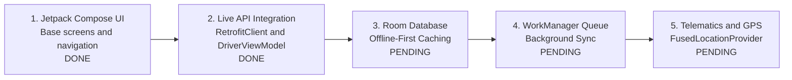

# KPFC Fleet Management — Driver Mobile Application & Operations Specification

> **Document Status:** Active Implementation  
> **Backend Status:** Phase 6 Backend API Completed & Tested (78 tests passing)  
> **Mobile App Status:** Base Android App Scaffaffolded & Active in `/driver-app`  
> **Target Platform:** Android (Native Kotlin 2.2 / Jetpack Compose / Material 3)  
> **Backend System:** KPFC Fleet Management & Telematics API (Laravel 12 / PHP 8.5)  
> **Reference Documents:** [FLEETDOC.MD](FLEETDOC.MD) & [TODO.MD](TODO.MD) (Phase 6)

---

## 1. Overview & Operational Scope

The KPFC Driver Mobile Application is the frontline operational client for commercial transport execution across the KPFC branch network. Drivers use this native Android application to receive assigned trips, navigate sequential delivery stops, record stop arrival and completion, request return-to-base authorizations when unforeseen obstacles occur, and record accurate trip mileage.

### Core Principles
1. **Sequential Stop Integrity:** Drivers must execute stops in planned sequence unless explicitly overridden or authorized to return to base.
2. **Offline-Resilient Operation:** Drivers may enter basements, remote depots, or dead zones with degraded cellular connectivity. All trip details must be cached locally, and actions must queue for synchronization.
3. **Immutability of Business Requirements:** Drivers cannot arbitrarily alter or drop stops from a transport request; alterations require formal Return-to-Base requests approved by a Fleet Manager.
4. **Mileage & Telematics Auditability:** Starting and ending mileages recorded by the driver are audited against the onboard Protrack365 GPS telemetry and recorded in `vehicle_mileage`.

---

## 2. Backend Phase 6 Status (Completed)

The Phase 6 backend implementation is fully deployed and verified with automated tests in `tests/Feature/DriverApiTest.php`.

### 2.1 Database Schema & Tables

#### `trips` Table
- `id`: Primary key
- `trip_number`: Unique identifier (e.g. `TRP-2026-00001`)
- `transport_request_id`: Nullable link to commercial transport request
- `vehicle_id`: Foreign key to `vehicles(id)`
- `driver_external_user_id`: External driver user ID
- `status`: `planned`, `in_progress`, `returning_to_base`, `completed`, `cancelled`
- `planned_start`, `actual_start`, `planned_end`, `actual_end`: Timestamps
- `start_latitude`, `start_longitude`, `start_location_name`: Starting location
- `starting_mileage`, `ending_mileage`, `trip_mileage`: Odometer readings (km)
- `planned_route`, `actual_route`: JSON telemetry data

#### `trip_stops` Table
- `id`: Primary key
- `trip_id`: Foreign key to `trips(id)` (cascade delete)
- `sequence`: Integer stop order (1, 2, 3...)
- `stop_type`: `pickup`, `delivery`, `return`, `waypoint`
- `shop_id`, `external_shop_id`: Shop references
- `location_name`, `address`: Destination details
- `latitude`, `longitude`: GPS coordinates
- `contact_phone`, `delivery_instructions`: On-site instructions
- `status`: `pending`, `arrived`, `completed`, `failed`, `cancelled`
- `arrived_at`, `departed_at`: Timestamps
- **Constraint:** Unique composite key on `['trip_id', 'sequence']`

#### `return_to_base_requests` Table
- `id`: Primary key
- `trip_id`: Foreign key to `trips(id)`
- `driver_external_user_id`: Requesting driver
- `reason`: Text explanation
- `latitude`, `longitude`, `current_location_name`: Driver location snapshot
- `undelivered_stops`: JSON snapshot of remaining undelivered consignments
- `status`: `pending`, `approved`, `denied`
- `decision`, `decision_maker_external_user_id`, `decided_at`, `manager_comments`: Manager review audit trail

### 2.2 Live Backend API Endpoints

#### Driver Endpoints (`/api/driver/*`)
*Middleware: `['web', 'auth', 'fleet.access']`*
- `GET /api/driver/trips/active`: Get active trip (`in_progress` or `returning_to_base`)
- `GET /api/driver/trips/upcoming`: Get scheduled planned trips
- `GET /api/driver/assigned-vehicle`: Get currently assigned vehicle
- `POST /api/driver/trips/{trip}/start`: Manually start trip with starting mileage & coordinates
- `GET /api/driver/trips/{trip}/stops`: Get ordered stops
- `POST /api/driver/stops/{stop}/arrive`: Mark stop arrived (**enforces sequential stop validation**)
- `POST /api/driver/trips/{trip}/return-to-base`: Submit return request with remaining consignments
- `POST /api/driver/trips/{trip}/complete`: Complete trip, compute distance, update vehicle odometer

#### Fleet Manager Endpoints (`/api/fleet/return-requests/*`)
*Middleware: `['web', 'auth', 'fleet.access', 'fleet.write']`*
- `GET /api/fleet/return-requests`: List & filter return requests
- `POST /api/fleet/return-requests/{returnRequest}/decision`: Approve or deny return request

---

## 3. The Android Driver Application (`/driver-app`)

A standalone, interactive Android client is established in the [`driver-app/`](driver-app/) directory. It is directly openable and editable in **Android Studio**.

### 3.1 Project Location & Environment

- **Root Directory:** `c:\temp\tracker\driver-app`
- **Android Studio Project Root:** Open `driver-app` directly (not the outer repository root)
- **Gradle Version:** Gradle 9.6.0 via Wrapper (`gradle-wrapper.properties`)
- **Android Gradle Plugin (AGP):** 9.4.x / 8.7.x
- **Kotlin:** 2.2.x with Compose Compiler plugin
- **Java / JDK:** JDK 17 / 21
- **Min SDK:** 26 (Android 8.0) | **Target SDK:** 35 (Android 15)

### 3.2 Implemented Source Structure

```text
driver-app/
├── .gitignore                   # Ignores local.properties, build caches, and APKs
├── build.gradle.kts             # Root Gradle build script
├── settings.gradle.kts          # Project name, foojay toolchains, repository config
├── gradle.properties            # JVM memory and AndroidX flags
├── gradle/
│   ├── libs.versions.toml       # Version catalog (Compose BOM, Retrofit, Room, WorkManager)
│   └── wrapper/
│       └── gradle-wrapper.properties
└── app/
    ├── build.gradle.kts         # App dependencies, compileSdk 35, Jetpack Compose
    ├── proguard-rules.pro       # Release obfuscation & model serialization keep rules
    └── src/main/
        ├── AndroidManifest.xml  # Internet, Network State, Location permissions
        ├── res/values/
        │   ├── strings.xml      # App strings
        │   └── themes.xml       # Material themes
        └── java/com/kpfc/fleet/driver/
            ├── MainActivity.kt  # Activity entry point launching DriverApp
            ├── data/
            │   ├── MockDriverData.kt     # In-memory mock data for UI testing
            │   ├── model/
            │   │   └── TripModels.kt     # Kotlin DTOs matching backend JSON contracts
            │   └── api/
            │       └── DriverApiService.kt # Retrofit interface for Phase 6 endpoints
            └── ui/
                ├── DriverApp.kt          # Root coordinator & navigation state machine
                ├── theme/
                │   ├── Color.kt          # KPFC corporate palette (Navy & Green)
                │   └── Theme.kt          # Light & Dark Material 3 theme definitions
                ├── auth/
                │   └── LoginScreen.kt    # Credentials + KPFC SSO + Fast demo login
                ├── dashboard/
                │   └── DashboardScreen.kt # Vehicle badge, active mission card, upcoming list
                └── trip/
                    ├── TripExecutionScreen.kt # Sequential stops timeline, navigation & call intents
                    ├── ReturnToBaseDialog.kt   # Reason picker & consignment return preview
                    └── CompleteTripDialog.kt   # Final odometer entry & trip mileage calculation
```

---

## 4. Current Android Features & Screens

The app connects to the live Laravel backend API — no mock data. Authentication uses the same KPFC session-cookie system as the web app.

1. **Authentication Flow (`ui/auth/LoginScreen.kt`)**:
   - Driver Email & Password login via `POST /api/driver/login`.
   - Server URL configurable at runtime via gear icon → `ServerConfigDialog` (default: `http://10.0.2.2:8000/` for emulator).
   - Displays error banners from server (invalid credentials, no fleet access).
   - Loading indicator while auth request is in flight.

2. **Operations Dashboard (`ui/dashboard/DashboardScreen.kt`)**:
   - Loads assigned vehicle via `GET /api/driver/assigned-vehicle`.
   - Shows active trip (if any) via `GET /api/driver/trips/active`.
   - Lists upcoming scheduled trips via `GET /api/driver/trips/upcoming`.
   - **Start Trip** button launches `StartTripDialog` (odometer + location), then calls `POST /api/driver/trips/{trip}/start`.
   - Pull-to-refresh reloads all dashboard data.

3. **Trip Execution Stepper (`ui/trip/TripExecutionScreen.kt`)**:
   - Visual sequential stepper with color-coded stop states (`Completed`, `Arrived`, `Pending/Locked`).
   - **Sequential Enforcement:** Server returns 422 if preceding stops are not handled — shown as error toast.
   - **"I Have Arrived" Button:** Calls `POST /api/driver/stops/{stop}/arrive` and refreshes stop list.
   - **Turn-by-turn Navigation:** "Navigate" button dispatches an Android `Intent.ACTION_VIEW` geo-URI to Google Maps / Waze.
   - **Customer Contact:** Phone button dispatches dialer intent (`tel:`) to call receiving depot contact.
   - Pull-to-refresh reloads stop list from API.

4. **Return-to-Base Dialog (`ui/trip/ReturnToBaseDialog.kt`)**:
   - Select operational reasons (breakdown, road blockage, branch closed, safety).
   - Calls `POST /api/driver/trips/{trip}/return-to-base`; fleet manager approves via `POST /api/fleet/return-requests/{id}/decision`.
   - Trip transitions to `returning_to_base` on approval.

5. **Trip Completion Dialog (`ui/trip/CompleteTripDialog.kt`)**:
   - Prompts driver for final odometer reading upon return to depot.
   - Validates that ending mileage ≥ starting mileage.
   - Calls `POST /api/driver/trips/{trip}/complete`; records mileage in `vehicle_mileage` table.

6. **Session Management**:
   - `RetrofitClient` uses an in-memory `CookieJar` (thread-safe `ConcurrentHashMap`) to persist the Laravel session cookie across all requests.
   - Logout calls `POST /api/driver/logout` and clears the cookie store, returning to `LoginScreen`.

---

## 5. Git & Version Control Configuration

To prevent committing local build artifacts, personal SDK paths, or cache directories:

- **Local SDK config:** `driver-app/local.properties` is **strictly ignored** by `.gitignore`.
- **Build directories:** `driver-app/.gradle/`, `driver-app/build/`, and `driver-app/app/build/` are ignored.
- **IDE caches:** `driver-app/.idea/` and `*.iml` files are ignored.
- **Binaries:** `*.apk`, `*.aab`, `*.dex`, `*.class` are ignored.
- **Tracked in Git:** Only human-readable Kotlin code, XML layouts, Gradle build scripts (`build.gradle.kts`, `settings.gradle.kts`, `libs.versions.toml`), and documentation.

---

## 6. Next Steps & Development Roadmap



1. **Step 1 (Done):** Base Jetpack Compose UI — screens, navigation, dialogs, KPFC theme.
2. **Step 2 (Done):** Live API integration — `RetrofitClient` (OkHttp + session cookie jar), `DriverRepository`, `DriverViewModel` (StateFlow). `MockDriverData.kt` deleted. All screens wired to live Laravel backend.
3. **Step 3 (Next):** Implement Room Database (`TripDao`, `TripStopDao`) for offline storage when connectivity drops.
4. **Step 4:** Implement Android `WorkManager` worker to queue arrival, return-to-base, and completion events offline and sync them when connectivity resumes.
5. **Step 5:** Integrate Android `FusedLocationProviderClient` to attach accurate GPS coordinates to start and arrival events.
