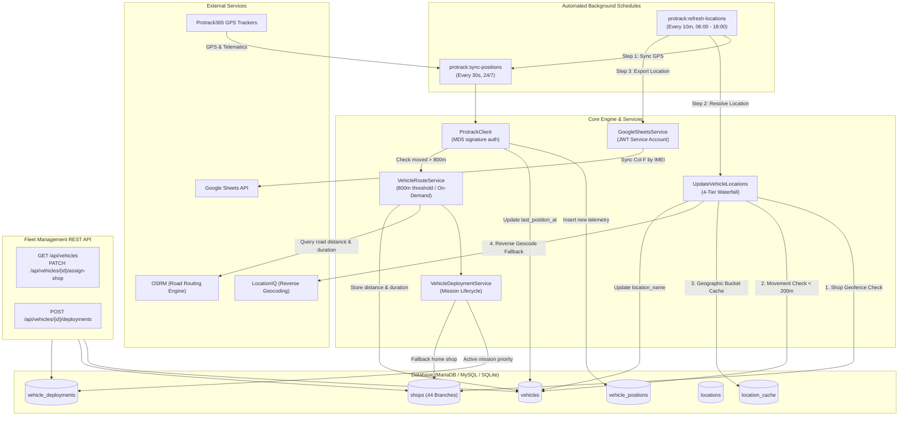

# KPFC Fleet Tracker & Telematics Backend

An automated GPS fleet tracking, telematics ingestion, and dispatch management backend built with Laravel.

The application continuously collects real-time vehicle telematics from **Protrack365** GPS trackers, resolves coordinates into human-readable locations and branch geofences using a multi-tier cache, calculates road network distances and ETAs via **OSRM**, manages vehicle missions via **Deployments**, exposes a **Fleet Management REST API**, and synchronizes operational status to **Google Sheets**.

---

## Architecture Overview



---

## Core Capabilities

### 1. Real-Time Telematics & Ingestion
* **Provider**: Connects to Protrack365 API using secure timestamped MD5 signatures (`md5(md5($password) . $timestamp)`).
* **Schedule**: Ingests positions every **30 seconds, 24/7** via `protrack:sync-positions`.
* **Telemetry Data Stored**:
  * Latitude, longitude, speed, course heading, battery voltage.
  * Total mileage, daily mileage, odometer reading.
  * Sensor indicators: ACC (ignition state), door state, fuel level, external power, defense status, engine oil/power cutoff, and temperature sensors.
* **Deduplication**: Automatically discards records if the incoming GPS timestamp is older than or equal to the vehicle's `last_position_at`.

### 2. Multi-Tier Location Resolution
Translating raw GPS coordinates into human-readable locations runs every **10 minutes between 06:00 and 18:00**. To maximize performance and eliminate unnecessary third-party API costs, `vehicles:update-locations` uses a 4-tier waterfall:

1. **Shop & Branch Geofence** (`ShopLocationService`):
   * Checks if the vehicle is within the geofence radius (typically 450m - 500m) of any of the **44 known company branches** in the `shops` table. If matched, the shop name is assigned immediately.
2. **Movement Threshold Cache (< 200m)**:
   * If the vehicle has moved less than 200 meters from its previously resolved coordinate, the existing location name is preserved.
3. **Shared Geographic Grid Cache** (`LocationCacheService`):
   * Coordinates are bucketed into decimal regions (rounded to 4 decimals, ~11m precision). If another vehicle previously resolved a location within 250m, that result is reused from `location_cache`.
4. **External Geocoding** (`LocationIqService`):
   * Only if tiers 1–3 miss, a request is sent to LocationIQ. The normalized address (`road, suburb, neighbourhood, city, county`) is saved into `location_cache` for future fleet-wide reuse.

### 3. Road Routing & ETAs (`OSRM`)
* Uses Open Source Routing Machine (OSRM) to calculate real-world driving road distance (`road_distance_meters`) and expected driving time (`road_duration_seconds`).
* **Trigger Conditions**:
  * OSRM is queried automatically in the background when the vehicle moves **more than 800 meters** from its last calculation point, or whenever its destination changes.
  * OSRM is also calculated **immediately** whenever a vehicle's home shop is assigned/changed, or when a deployment mission is dispatched.

### 4. Fleet Management: Home Shop vs Deployments
The system cleanly separates permanent base locations from temporary assignments:

| Concept | Table & Model | Description |
| :--- | :--- | :--- |
| **Permanent Home Shop** | `vehicles.assigned_shop_id` &rarr; `shops` | The vehicle's home branch/depot. Default fallback destination for distance and ETA calculations. |
| **Active Deployment** | `vehicle_deployments` (`VehicleDeployment`) | A temporary mission or delivery assignment targeting a `Shop` or custom `Location`. Takes priority over the home shop while active (`planned`, `dispatched`, `in_progress`). |

### 5. Automated Google Sheets Synchronization
* Directly mints Google OAuth2 JWTs using RS256/OpenSSL and a Google Service Account key (zero bulky Google client SDKs).
* Every 10 minutes (06:00–18:00), matches spreadsheet rows by vehicle IMEI on the `Protrack365` tab and updates Column F with the latest human-readable location.

---

## Complete API Reference

The backend exposes both high-level Fleet Management REST endpoints and low-level Protrack hardware integration routes.

### 1. Fleet Management Endpoints (`/api/*`)

#### List Vehicles
`GET /api/vehicles`
* **Query Parameters**:
  * `search` - Filter by plate number, IMEI, or device name (e.g. `?search=KDD`)
  * `shop_id` - Filter by assigned home shop (e.g. `?shop_id=2`)
  * `active` - Filter by active status (`?active=1` or `?active=0`)
  * `all` - Return unpaginated collection (`?all=1`); default paginates by 25
* **Sample Response (200 OK)**:
```json
{
  "data": [
    {
      "id": 1,
      "plate_number": "KDD 123A",
      "imei": "868204051234567",
      "status": "moving",
      "location_name": "Eldoret Town, Uasin Gishu",
      "latest_telemetry": {
        "latitude": 0.5142,
        "longitude": 35.2698,
        "speed": 45.2,
        "ignition_on": true
      },
      "assigned_shop": {
        "id": 4,
        "name": "Eldoret Branch",
        "code": "KPFC-004"
      },
      "active_deployment": null,
      "routing": {
        "destination_type": "shop",
        "destination_id": 4,
        "distance_meters": 4800,
        "distance_km": 4.8,
        "duration_seconds": 480,
        "duration_minutes": 8,
        "calculated_at": "2026-09-16T10:15:00Z"
      }
    }
  ]
}
```

#### Get Vehicle Details
`GET /api/vehicles/{id}`
* Returns full telemetry, latest GPS record, route calculation, and deployment history for a single vehicle.

#### Assign / Update Home Shop
`PATCH /api/vehicles/{id}/assign-shop`
* **Body (JSON)**:
```json
{
  "shop_id": 4
}
```
*(Pass `"shop_id": null` to unassign the vehicle from a home shop).*

#### Dispatch Deployment
`POST /api/vehicles/{id}/deployments`
* **Body (JSON)**:
```json
{
  "destination_type": "shop",
  "destination_id": 6,
  "purpose": "Morning Goods Delivery",
  "notes": "Urgent restock",
  "status": "dispatched"
}
```
* **Validation Rules**:
  * `destination_type`: Must be `shop` or `location`.
  * `destination_id`: Must exist and be `active`.
  * The vehicle cannot have another active deployment (`planned`, `dispatched`, or `in_progress`).

---

### 2. Protrack Diagnostic & Hardware Sync Endpoints

| Method | Endpoint | Description |
| :--- | :--- | :--- |
| `GET` | `/protrack/test` | Test connectivity & token generation with Protrack365. |
| `GET` | `/protrack/devices` | Raw list of hardware tracker devices from Protrack. |
| `GET` | `/protrack/device-count` | Count of registered hardware devices. |
| `GET` | `/protrack/accounts` | Device counts broken down by Protrack customer accounts. |
| `GET` | `/protrack/track/{imei}` | Live position, speed, and resolved location for a specific IMEI. |
| `GET` | `/up` | Laravel health check endpoint. |

---

## Visual Testing with Thunder Client (VS Code)

To visually test all endpoints inside VS Code without installing any packages in Laravel:

1. **Install Extension**: Press `Ctrl + Shift + X` &rarr; search for **Thunder Client** &rarr; click **Install**.
2. **Start Server**:
   ```sh
   php artisan serve
   ```
3. **Open Thunder Client**: Click the lightning bolt icon (⚡) on the left sidebar &rarr; click **New Request**.
4. **Quick Tests**:
   * **List Fleet**: `GET http://127.0.0.1:8000/api/vehicles` &rarr; Click **Send**.
   * **Assign Home Shop**: `PATCH http://127.0.0.1:8000/api/vehicles/1/assign-shop` &rarr; In **Body** &rarr; select **JSON** &rarr; paste `{"shop_id": 4}` &rarr; Click **Send**.
   * **Dispatch Mission**: `POST http://127.0.0.1:8000/api/vehicles/1/deployments` &rarr; In **Body** &rarr; select **JSON** &rarr; paste `{"destination_type": "shop", "destination_id": 6}` &rarr; Click **Send**.

---

## Artisan Commands & Automation

| Command | Schedule | Description |
| :--- | :--- | :--- |
| `php artisan protrack:sync-positions` | Every 30 seconds (24/7) | Ingests latest GPS positions and telematics from Protrack365. |
| `php artisan vehicles:update-locations` | On demand / Scheduled | Resolves coordinates into human-readable locations via the 4-tier waterfall. |
| `php artisan protrack:sync-google-sheets` | On demand / Scheduled | Updates Column F in Google Sheets with resolved locations. |
| `php artisan protrack:refresh-locations` | Every 10 min (06:00 - 18:00) | Pipeline command running position sync, location resolution, and Google Sheets sync in sequence. |
| `php artisan protrack:sync-vehicles` | On demand | Discovers and synchronizes new GPS tracker hardware into the `vehicles` table. |
| `php artisan vehicles:update-route-distances` | On demand | Recalculates OSRM driving distance and duration for all vehicles assigned to a shop. |
| `php artisan shop:test-location` | Utility | Tests shop proximity and geofence matching against test coordinates. |

To run the scheduler worker locally:
```sh
php artisan schedule:work
```

---

## Environment Configuration

Key `.env` configuration keys:

```env
# Database
DB_CONNECTION=mysql
DB_HOST=127.0.0.1
DB_PORT=3306
DB_DATABASE=protrack
DB_USERNAME=root
DB_PASSWORD=

# Protrack365 API
PROTRACK_BASE_URL=https://api.protrack365.com
PROTRACK_ACCOUNT=your_protrack_account
PROTRACK_PASSWORD=your_protrack_password
PROTRACK_VEHICLE_ACCOUNT=kpfctrack1

# LocationIQ Reverse Geocoding
LOCATIONIQ_BASE_URL=https://us1.locationiq.com
LOCATIONIQ_API_KEY=your_locationiq_api_key

# Google Sheets Synchronization
GOOGLE_SHEETS_SPREADSHEET_ID=your_spreadsheet_id
GOOGLE_SHEETS_CREDENTIALS=storage/app/google-credentials.json
```

---

## Setup & Testing

1. **Install Dependencies**:
   ```sh
   composer install
   ```

2. **Run Migrations & Seed Branches**:
   ```sh
   php artisan migrate
   php artisan db:seed --class=ShopSeeder
   ```

3. **Run Automated Test Suite**:
   ```sh
   php artisan test
   ```