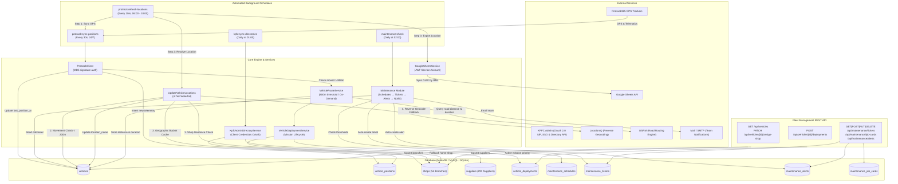

# KPFC Fleet Tracker & Telematics Backend
An automated GPS fleet tracking, telematics ingestion, dispatch management, and fleet maintenance backend built with Laravel.

The application continuously collects real-time vehicle telematics from **Protrack365** GPS trackers, resolves coordinates into human-readable locations and branch geofences using a multi-tier cache, calculates road network distances and ETAs via **OSRM**, manages vehicle missions via **Deployments**, exposes a **Fleet Management REST API**, synchronizes operational status to **Google Sheets**, integrates centralized authentication and user lifecycle management with **KPFC Admin Single Sign-On (SSO)**, synchronizes the Branches and Suppliers directory from **KPFC Admin**, and runs a **Fleet Maintenance module** with automated mileage/time threshold checks, ticket creation, and team notifications.

---
## Architecture Overview

```mermaid
flowchart TD

      subgraph External["External Services"]
            KPFCAdmin["KPFC Admin (OAuth 2.0 IdP, SSO & Directory API)"]
            P365["Protrack365 GPS Trackers"]
            LIQ["LocationIQ (Reverse Geocoding)"]
            OSRM["OSRM (Road Routing Engine)"]
            GS["Google Sheets API"]
            MAIL["Mail / SMTP (Team Notifications)"]
      end

      subgraph Scheduled["Automated Background Schedules"]
            SC1["protrack:sync-positions\n(Every 30s, 24/7)"]
            SC2["protrack:refresh-locations\n(Every 10m, 06:00 - 18:00)"]
            SC3["kpfc:sync-directories\n(Daily at 01:00)"]
            SC4["maintenance:check\n(Daily at 02:00)"]
      end

      subgraph CoreEngine["Core Engine & Services"]
            ProtrackClient["ProtrackClient\n(MD5 signature auth)"]
            LocResolver["UpdateVehicleLocations\n(4-Tier Waterfall)"]
            RouteService["VehicleRouteService\n(800m threshold / On-Demand)"]
            DeployService["VehicleDeploymentService\n(Mission Lifecycle)"]
            GoogleService["GoogleSheetsService\n(JWT Service Account)"]
            DirService["KpfcAdminDirectoryService\n(Client Credentials OAuth)"]
            MaintService["Maintenance Module\n(Schedules → Tickets → Alerts → Notify)"]
      end

      subgraph Storage["Database (MariaDB / MySQL / SQLite)"]
            Vehicles[("vehicles")]
            Positions[("vehicle_positions")]
            Shops[("shops (54 Branches)")]
            Suppliers[("suppliers (291 Suppliers)")]
            Deployments[("vehicle_deployments")]
            MaintSchedules[("maintenance_schedules")]
            MaintTickets[("maintenance_tickets")]
            MaintAlerts[("maintenance_alerts")]
            JobCards[("maintenance_job_cards")]
      end

      subgraph API["Fleet Management REST API"]
            V_API["GET /api/vehicles\nPATCH /api/vehicles/{id}/assign-shop"]
            D_API["POST /api/vehicles/{id}/deployments"]
            M_API["GET|POST|PUT|DELETE /api/maintenance/tickets\n/api/maintenance/job-cards\n/api/maintenance/alerts"]
      end

      P365 -->|GPS & Telematics| SC1
      SC1 --> ProtrackClient
      ProtrackClient -->|Insert new telemetry| Positions
      ProtrackClient -->|Update last_position_at| Vehicles
      ProtrackClient -->|Check moved > 800m| RouteService
      SC2 -->|Step 1: Sync GPS| SC1
      SC2 -->|Step 2: Resolve Location| LocResolver
      SC2 -->|Step 3: Export Location| GoogleService
      SC3 --> DirService
      DirService -->|Upsert branches| Shops
      DirService -->|Upsert suppliers| Suppliers
      SC4 --> MaintService
      MaintService -->|Read odometer| Vehicles
      MaintService -->|Check thresholds| MaintSchedules
      MaintService -->|Auto-create ticket| MaintTickets
      MaintService -->|Auto-create alert| MaintAlerts
      MaintService -->|Email team| MAIL
      LocResolver -->|1. Shop Geofence Check| Shops
      LocResolver -->|2. Movement Check < 200m| Vehicles
      LocResolver -->|3. Geographic Bucket Cache| Positions
      LocResolver -->|4. Reverse Geocode Fallback| LIQ
      LocResolver -->|Update location_name| Vehicles
      RouteService --> DeployService
      DeployService -->|Active mission priority| Deployments
      DeployService -->|Fallback home shop| Shops
      RouteService -->|Query road distance & duration| OSRM
      RouteService -->|Store distance & duration| Vehicles
      GoogleService -->|Sync Col F by IMEI| GS
      API --> Vehicles
      API --> Shops
      API --> Deployments
      M_API --> MaintTickets
      M_API --> JobCards
      M_API --> MaintAlerts
```

---
## Core Capabilities

### 1. Real-Time Telematics & Ingestion
* **Provider**: Connects to Protrack365 API using secure timestamped MD5 signatures (`md5(md5($password) . $timestamp)`).
* **Schedule**: Ingests positions every **30 seconds, 24/7** via `protrack:sync-positions`.
* **Telemetry Data Stored**: Latitude, longitude, speed, course heading, battery voltage, total mileage, daily mileage, odometer reading, sensor indicators (ACC/ignition, door state, fuel level, external power, defense status, engine oil/power cutoff, temperature sensors).
* **Deduplication**: Automatically discards records if the incoming GPS timestamp is older than or equal to the vehicle's `last_position_at`.

### 2. Multi-Tier Location Resolution
Translating raw GPS coordinates into human-readable locations runs every **10 minutes between 06:00 and 18:00** via a 4-tier waterfall:

1. **Shop & Branch Geofence** — Checks if the vehicle is within the geofence radius (~500m) of any of the **54 known company branches**. If matched, the shop name is assigned immediately.
2. **Movement Threshold Cache (<200m)** — If the vehicle has moved less than 200m, the existing location name is preserved.
3. **Shared Geographic Grid Cache** — Coordinates are bucketed (~11m precision). If another vehicle previously resolved a location within 250m, that result is reused.
4. **External Geocoding (LocationIQ)** — Only if tiers 1–3 miss, a request is sent to LocationIQ. The result is cached for fleet-wide reuse.

### 3. Road Routing & ETAs (OSRM)
* Calculates real-world driving distance (`road_distance_meters`) and expected time (`road_duration_seconds`).
* Triggered automatically when a vehicle moves **>800m** from its last calculation point, or whenever its destination changes.
* Also calculated immediately on home shop assignment changes or deployment dispatch.

### 4. Fleet Management: Home Shop vs Deployments

| Concept | Table & Model | Description |
| :--- | :--- | :--- |
| **Permanent Home Shop** | `vehicles.assigned_shop_id` → `shops` | The vehicle's home branch/depot. Default fallback destination for distance and ETA calculations. |
| **Active Deployment** | `vehicle_deployments` (`VehicleDeployment`) | A temporary mission targeting a `Shop` or custom `Location`. Takes priority over home shop while active. |

### 5. Fleet Maintenance Module
A fully automated fleet maintenance lifecycle:

* **Maintenance Schedules** (`maintenance_schedules`) — Per-vehicle service schedules supporting both **mileage-based** (`interval_km`, `next_service_km`, `alert_threshold_km`) and **time-based** (`interval_days`, `next_service_at`, `alert_threshold_days`) triggers.
* **Automated Window Checks** (`maintenance:check`, runs daily at 02:00) — Compares each vehicle's latest odometer reading or current date against its active schedule thresholds. When a vehicle enters a maintenance window, the system:
  1. Automatically creates a **Maintenance Ticket** (status: `open`, type: `service`) with the due reason embedded.
  2. Creates a **Maintenance Alert** that surfaces on the fleet dashboard.
  3. Dispatches a **`MaintenanceDueNotification`** via email and database to the maintenance team.
  4. Deduplicates — will not create a second ticket if an open one already exists for the same vehicle and service.
* **Full Maintenance CRUD API** — Complete REST endpoints for Tickets, Job Cards, and Alerts (see API reference below).

### 6. KPFC Admin Directory Synchronization
* Authenticates against KPFC Admin via **OAuth 2.0 Client Credentials** using separate scoped credentials per directory (`fleet:branches`, `fleet:suppliers`).
* Synchronizes **54 branches** and **291 suppliers** into local `shops` and `suppliers` tables via daily upsert (`kpfc:sync-directories`, runs daily at 01:00).
* Branches without GPS coordinates (vans, staging areas) are supported with nullable lat/lng.
* Test connectivity any time: `php artisan kpfc:test-api`.

### 7. Automated Google Sheets Synchronization
* Directly mints Google OAuth2 JWTs using RS256/OpenSSL and a Google Service Account key (zero bulky Google client SDKs).
* Every 10 minutes (06:00–18:00), matches spreadsheet rows by vehicle IMEI on the `Protrack365` tab and updates Column F with the latest human-readable location.

### 8. KPFC Admin Single Sign-On (SSO) & Identity Federation
The Fleet application operates as an OAuth 2.0 confidential client federated with **KPFC Admin** as the authoritative Identity Provider:

* **Authorization Code Grant with PKCE (S256)** — Enforces single-use `state` comparison and timing-safe CSRF protection.
* **Immutable Account Linking by `sub`** — Local shadow users keyed strictly by the immutable Admin `sub` (`kpfc_sub`). Mutable attributes sync on login and via webhook but never used to merge accounts.
* **Encrypted Server-Side Token Persistence** — OAuth tokens stored encrypted in `user_sso_tokens` via Laravel's `'encrypted'` cast. Never stored in browser localStorage.
* **Atomic Token Refresh & Rotation** — 15-minute access tokens; 30-day rotating refresh tokens protected by row-locking transactions.
* **Replay-Safe Lifecycle Webhook Receiver** — HMAC-SHA256 signed, timestamp-skew-validated (±5 min), idempotency enforced via `sso_event_receipts`.

---
## API Reference

### Fleet Vehicles
| Method | Endpoint | Description |
| :--- | :--- | :--- |
| `GET` | `/api/vehicles` | List vehicles with live locations, status, home shops, and active missions. Supports `?search=`, `?shop_id=`, `?active=`, `?all=1`. |
| `GET` | `/api/vehicles/{vehicle}` | Full telemetry, GPS record, route calculation, and deployment history. |
| `GET` | `/api/vehicles/{vehicle}/location` | Live GPS position and telemetry. |
| `POST` | `/api/vehicles/{vehicle}/location` | Ingest GPS position update. |
| `PATCH` | `/api/vehicles/{vehicle}/assign-shop` | Set or clear the vehicle's permanent home shop (`{"shop_id": 4}` or `{"shop_id": null}`). |
| `POST` | `/api/vehicles/{vehicle}/deployments` | Dispatch vehicle on a temporary mission. |
| `PATCH` | `/api/vehicles/{vehicle}/deployments/{deployment}/release` | Complete/release an active deployment. |
| `PATCH` | `/api/vehicles/{vehicle}/deployments/{deployment}/cancel` | Cancel a planned or dispatched deployment. |

### Maintenance — Tickets
| Method | Endpoint | Description |
| :--- | :--- | :--- |
| `GET` | `/api/maintenance/overview` | High-level counts: open tickets, in-progress, active job cards, active alerts, recent repairs. |
| `GET` | `/api/maintenance/tickets` | List tickets. Supports `?vehicle_id=`, `?status=`, `?ticket_type=`. |
| `POST` | `/api/maintenance/tickets` | Create a maintenance ticket. |
| `GET` | `/api/maintenance/tickets/{ticket}` | Show a single ticket. |
| `PUT` | `/api/maintenance/tickets/{ticket}` | Update ticket status, priority, title, notes. |
| `DELETE` | `/api/maintenance/tickets/{ticket}` | Delete a ticket. |

### Maintenance — Job Cards
| Method | Endpoint | Description |
| :--- | :--- | :--- |
| `GET` | `/api/maintenance/job-cards` | List job cards. Supports `?vehicle_id=`, `?status=`. |
| `POST` | `/api/maintenance/job-cards` | Create a job card. |
| `GET` | `/api/maintenance/job-cards/{jobCard}` | Show a single job card with parts and tool assignments. |
| `PUT` | `/api/maintenance/job-cards/{jobCard}` | Update job card (diagnosis, work performed, status, notes). |
| `DELETE` | `/api/maintenance/job-cards/{jobCard}` | Delete a job card. |

### Maintenance — Alerts
| Method | Endpoint | Description |
| :--- | :--- | :--- |
| `GET` | `/api/maintenance/alerts` | List active alerts (most recent 20). |
| `POST` | `/api/maintenance/alerts` | Manually create a maintenance alert. |
| `GET` | `/api/maintenance/alerts/{alert}` | Show a single alert. |
| `PUT` | `/api/maintenance/alerts/{alert}` | Update alert status or message. |
| `DELETE` | `/api/maintenance/alerts/{alert}` | Delete an alert. |
| `GET` | `/api/maintenance/vehicles/{vehicle}` | All maintenance records for a specific vehicle (schedules, alerts, tickets, job cards, repairs). |

### SSO & Auth
| Method | Endpoint | Description |
| :--- | :--- | :--- |
| `GET` | `/api/auth/kpfc/redirect` | Initiate PKCE OAuth authorization flow. |
| `GET` | `/api/auth/kpfc/callback` | OAuth code exchange callback. |
| `POST` | `/api/auth/kpfc/logout` | Revoke tokens and terminate local session. |
| `POST` | `/api/sso/webhook` | Replay-safe, HMAC-signed user lifecycle event receiver. |
| `POST` | `/api/auth/kpfc/webhook` | Alternate lifecycle webhook endpoint. |

### Shops
| Method | Endpoint | Description |
| :--- | :--- | :--- |
| `GET` | `/api/shops` | List all active branches for map geofences and vehicle operations. |

---
## Artisan Commands & Automation

| Command | Schedule | Description |
| :--- | :--- | :--- |
| `protrack:sync-positions` | Every 30s (24/7) | Ingests latest GPS positions and telematics from Protrack365. |
| `protrack:refresh-locations` | Every 10m (06:00–18:00) | Runs position sync → location resolution → Google Sheets sync in sequence. |
| `protrack:sync-vehicles` | Daily at 00:05 | Discovers and synchronizes GPS tracker hardware into the `vehicles` table. |
| `kpfc:sync-directories` | Daily at 01:00 | Syncs 54 branches and 291 suppliers from KPFC Admin into local DB. |
| `kpfc:test-api` | On demand | Tests KPFC Admin API connectivity and dumps a sample payload. |
| `maintenance:check` | Daily at 02:00 | Checks vehicle mileage and time thresholds; auto-creates tickets, alerts, and emails the team. |
| `vehicles:update-route-distances` | On demand | Recalculates OSRM driving distance and duration for all vehicles. |

Run the scheduler locally:
```sh
php artisan schedule:work
```

---
## Environment Configuration

```env
# Database
DB_CONNECTION=mysql
DB_HOST=127.0.0.1
DB_PORT=3306
DB_DATABASE=protrack
DB_USERNAME=root
DB_PASSWORD=

# Protrack365 API
PROTRACK_BASE_URL=https://api.protrack365.com
PROTRACK_ACCOUNT=your_protrack_account
PROTRACK_PASSWORD=your_protrack_password
PROTRACK_VEHICLE_ACCOUNT=kpfctrack1

# LocationIQ Reverse Geocoding
LOCATIONIQ_BASE_URL=https://us1.locationiq.com
LOCATIONIQ_API_KEY=your_locationiq_api_key

# Google Sheets Synchronization
GOOGLE_SHEETS_SPREADSHEET_ID=your_spreadsheet_id
GOOGLE_SHEETS_CREDENTIALS=storage/app/google/protrack.json

# KPFC Admin Single Sign-On (OAuth 2.0 & Lifecycle Webhooks)
KPFC_SSO_ISSUER=https://admin-staging.kpfcbuilders.com
KPFC_SSO_CLIENT_ID=your_sso_client_id
KPFC_SSO_CLIENT_SECRET=your_sso_client_secret
KPFC_SSO_REDIRECT_URI=http://localhost:8000/auth/kpfc/callback
KPFC_SSO_SCOPES="fleet:login fleet:profile"
KPFC_SSO_WEBHOOK_SECRET=your_webhook_signing_secret

# KPFC Admin Directory API — OAuth Credentials
KPFC_ADMIN_URL=https://admin-staging.kpfcbuilders.com
KPFC_ADMIN_TOKEN_ENDPOINT=https://admin-staging.kpfcbuilders.com/oauth/token

# Branches Directory (scope: fleet:branches)
# Endpoint: /api/v1/fleet/shops
KPFC_BRANCH_CLIENT_ID=your_branch_client_id
KPFC_BRANCH_CLIENT_SECRET=your_branch_client_secret

# Suppliers Directory (scope: fleet:suppliers)
# Endpoint: /api/v1/fleet/suppliers
KPFC_SUPPLIER_CLIENT_ID=your_supplier_client_id
KPFC_SUPPLIER_CLIENT_SECRET=your_supplier_client_secret

# Mail (for Maintenance Team Notifications)
MAIL_MAILER=smtp
MAIL_HOST=your_smtp_host
MAIL_PORT=587
MAIL_USERNAME=your_smtp_user
MAIL_PASSWORD=your_smtp_password
MAIL_FROM_ADDRESS=fleet@kpfc.co.ke
MAIL_FROM_NAME="KPFC Fleet System"
```

> The maintenance team notification email is configured via `config/mail.php` as `maintenance_team_email` (defaults to `maintenance@kpfc.co.ke`).

---
## Setup & Testing

1. **Install Dependencies**:
   ```sh
   composer install
   ```

2. **Configure Environment**:
   ```sh
   cp .env.example .env
   php artisan key:generate
   # Fill in your .env values
   ```

3. **Run Migrations**:
   ```sh
   php artisan migrate
   ```

4. **Sync Branches & Suppliers from KPFC Admin**:
   ```sh
   # Test connectivity first
   php artisan kpfc:test-api

   # Pull all branches (54) and suppliers (291) into the local DB
   php artisan kpfc:sync-directories
   ```

5. **Run the Scheduler** (development):
   ```sh
   php artisan schedule:work
   ```

6. **Test Maintenance Window Checks Manually**:
   ```sh
   php artisan maintenance:check
   ```

7. **Run Automated Test Suite**:
   ```sh
   # Run all tests
   php artisan test

   # Run maintenance tests only
   php artisan test --filter MaintenanceTest

   # Run SSO certification suite
   vendor/bin/phpunit tests/Feature/KpfcSsoTest.php
   ```

8. **Open the Test Dashboard** (visual API testing):
   ```sh
   php artisan serve
   # Open: http://localhost:8000/test-dashboard
   ```
   The dashboard provides a live map, vehicle management, maintenance ticket CRUD (create, edit, delete), and inventory overview — all wired to the production API.

---
## Diagnostic & Hardware Testing Routes
These routes are in `routes/web.php` and exist for development and diagnostics only. They are **not** the production Fleet Management API.

| Method | Endpoint | Description |
| :--- | :--- | :--- |
| `GET` | `/protrack/test` | Test connectivity & token generation with Protrack365. |
| `GET` | `/protrack/devices` | Raw list of hardware tracker devices from Protrack. |
| `GET` | `/protrack/device-count` | Count of registered hardware devices. |
| `GET` | `/protrack/accounts` | Device counts broken down by Protrack customer accounts. |
| `GET` | `/protrack/track/{imei}` | Live position, speed, and resolved location for a specific IMEI. |
| `GET` | `/up` | Laravel health check endpoint. |
